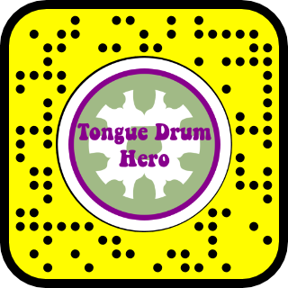

# HeARo Framework
By Ethan Ruoff (Team Tongue Drum Hero | er3074)
Submitted December 22nd, 2021

Developed on Lens Studio by Snap Inc. for the Next Generation (2021) Spectacles

A demo of Tongue Drum Hero is viewable at ___

## Directory Overview
This repo is structured like a standard Lens Studio project with all of the resources in the "Public" folder. The root directory contains the following files:
- icon.png : The icon for the lens when it is published
- Previews folder : This folder contains all of the custom previews that you want to use in the simulation panel.
- project.data : Stores the data for the project. Do NOT edit.
- Public folder : This folder contains all of the resources used in the project.
    - 3D Carousel Resources : All of the resources used for the song selection and difficulty selection menus
        - Icons : Contains the artwork used for the selection menus
    - 3D_Carousel.oprfb : The Prefab for the selection menus
    - ExtendedMarkerTracking : Contains the script used for extended marker tracking
    - Extended_Marker_Tracking.oprfb : The prefab for extended marker tracking
    - Magnifying Hint : Contains all of the resources used for the screen that pops up before the marker is detected
    - Markers : Contains the image marker and the image the image marker uses
    - Materials : Contains all of the extraneous materials
        - Notes : Contains the materials used for the notes
    - Meshes : Contains the sphere and plane meshes used in the project
    - Scripts : Contains any scripts used in the project
    - Textures : Contains extraneous textures used in the project
    - Tween : Contains everything the tween manager uses

- README.md : This file
- Snapcode.png : The snapcode that you can scan to use this lens.
- Tongue Drum Hero.lsproj : The project file for Tongue Drum Hero. Open this file to edit the project.
 
## How to Deploy Tongue Drum Hero
You can access Tongue Drum Hero by clicking [here](https://lens.snapchat.com/1a64020ee09343d7ae3aebe547a2e5d0?sender_web_id=f95da986-49ee-4ea2-a393-a23c957f7305&device_type=desktop&is_copy_url=true) or scanning this Snapcode:

If you want to fork and modify Tongue Drum Hero, then please follow these directions to view your modified version:
1. launch Lens Studio
2. Select "Open Project" and choose "Tongue Drum Hero.lsproj" in the root directory of this repo.
3. In the upper-right-hand corner of the project, there should be a button to send the project to Snapchat. Click the arrow next to it and select "Send to Spectacles"

## How to Setup the Tongue Drum Hero Tracker
The Tongue Drum Hero demonstration of the HeARo framework is currently only compatible to the "Yinama Steel Tongue Drum Percussion Instrument 11 Notes 10 inches" that can be purchased [here](https://www.amazon.com/gp/product/B07QF5FB12). Please make sure to purchase the 10 inch version and not the 12 inch. 

Once you have the Tongue Drum, the next step is to print the [marker](./Public/Markers/Scaled_Marker_Image.png) onto an 8.5x11in piece of paper in landscape. From there, you can mount the marker to the back of the tongue drum via popsicle sticks and tape or any other apparatus you see fit. Once mounted, then adjust the marker so that the notes line up. Alternatively, once mounted you can adjust the position of notes (Camera/Image Marker/Notes) scene object in the scene.

## Missing Features
There are many ways in which the HeARo framework can be further developed. One such way would be adding sound input to the framework. By taking in sound, HeARo could recognize the notes being played on an instrument. This would allow HeARo to judge how well users are playing and give them ways to measure their improvement over time via a leaderboard system. Another improvement would be implementing 3D instrument models by setting up an instrument mesh in the scene. This would allow HeARo to work with instruments that are played outside of the user’s field of view. One more potential future improvement for HeARo would be adding more gamification elements. For example, adding functionality that makes the green spheres fly towards the right note could make HeARo more fun to use while increasing engagement with users.

## Current Bugs
There are currently only two known bugs in Tongue Drum Hero that are both results of Lens Studio and the Spectacles. The first one is that when you move your head quickly as the marker is first discovered the notes will be significantly off. This is because the extended marker tracking only uses the first frame of the marker tracking while the marker tracking itself requires multiple frames to calibrate itself if the glasses are quickly moving. The second bug is that the extended marker tracking sometimes causes the notes to drift overtime. Both of these bugs can be fixed by simply restarting the lens.

## Asset Sources
I made all of the assets in this project except for the magnifying glass hint icon which way made by Snap Inc.